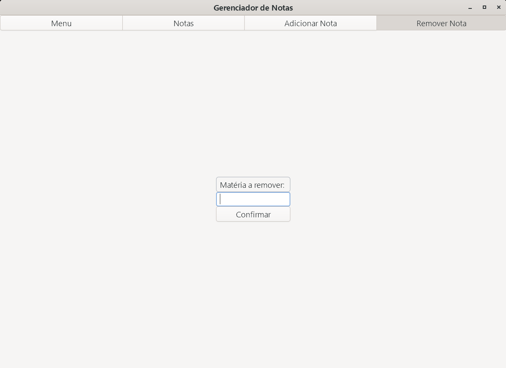

# Gerenciador de Notas

Aplicativo para gerenciar notas acadêmicas utilizando GTK4.

## Descrição

Este projeto é um gerenciador de notas acadêmicas que permite adicionar, remover e visualizar notas de diferentes matérias. Ele foi desenvolvido em C utilizando a biblioteca GTK4 para a interface gráfica. Produzido com o objetivo de aprendizado.

Tela inicial: 


Menu:


Visualizar Notas:


Adicionar Nota:


Remover Nota:



## Instalação

### Linux

1. Instale as dependências necessárias:
    ```bash
    sudo apt-get install build-essential pkg-config libgtk-4-dev
    ```

2. Clone o repositório:
    ```bash
    git clone https://github.com/lexguimaraes/Gerenciador_de_Notas.git
    cd Gerenciador_de_Notas
    ```

3. Compile o projeto:
    ```bash
    mkdir build
    cd build
    cmake ..
    make
    ```

4. Execute o programa:
    ```bash
    ./gerenciador-notas
    ```

### Windows

1. Instale o MSYS2 de [msys2.org](https://www.msys2.org/).

2. Abra o terminal MSYS2 MinGW64 e instale as dependências necessária:
    ```bash
    pacman -S mingw-w64-x86_64-gtk4 mingw-w64-x86_64-gcc mingw-w64-x86_64-pkgconf
    ```

3. Clone o repositório:
    ```bash
    git clone https://github.com/lexguimaraes/Gerenciador_de_Notas.git
    cd Gerenciador_de_Notas
    ```

4. Compile o projeto:
    ```bash
    mkdir build
    cd build
    gcc ../src/*.c -o gerenciador_notas.exe `pkg-config --cflags --libs gtk4` -mwindows
    ```

5. Execute o programa:
    ```bash
    ./gerenciador_notas.exe
    ```

## Uso

1. Ao iniciar o programa, digite seu nome e clique em "Confirmar".
2. Utilize os botões para adicionar, remover e visualizar notas.
3. As notas são salvas automaticamente em arquivos `.bin` e planilhas `.csv`.
4. Ao inserir matérias com o mesmo nome, elas serão apenas atualizadas com a nova nota e a nova carga horária.
5. Em sequentes usos com o mesmo nome, as notas continuam da última forma que o programa foi utilizado, evitando a necessidade de reescrever as notas.

## Troubleshooting

1. Em caso desse erro: "Package gtk4 was not found in the pkg-config search path." Tente: 
   ```bash
   export PKG_CONFIG_PATH=/mingw64/lib/pkgconfig:$PKG_CONFIG_PATH
   export XDG_DATA_DIRS=/mingw64/share:$XDG_DATA_DIRS
   ```
2. Em caso desse erro: "bash: gcc: command not found." Tente:
   ```bash
   export PATH=/mingw64/bin:$PATH
   ```

## Licença

Este projeto está licenciado sob a licença MIT. Veja o arquivo `LICENSE` para mais detalhes.